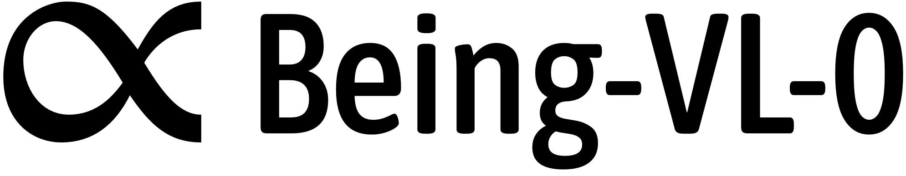

# From Pixels to Tokens: Byte-Pair Encoding on Quantized Visual Modalities

<p align="center">
    
<p>

<div align="center">

[](https://beingbeyond.github.io/Being-VL-0.5)
[](https://arxiv.org/abs/2410.02155)
[](./LICENSE)

</div>

<p align="center">
    
<p>

We propose a novel training paradigm for multimodal learning through our BPE Image Tokenizer, which applies the principles of text tokenization to visual data. Unlike conventional approaches, our method directly incorporates structural prior information into image tokens, enabling Transformer models to better learn across modalities. Our **Being-VL-0** model demonstrates how this paradigm effectively bridges the gap between visual and textual representation learning.

For more details, please refer to our paper: [From Pixels to Tokens: Byte-Pair Encoding on Quantized Visual Modalities](https://openreview.net/pdf?id=3TnLGGHhNx) (**ICLR'25**).

## News

- **[2025-06-26]**: 🔥🔥 We publish **Being-VL-0.5**, which is accepted by **ICCV 2025**! Check our paper [here](https://arxiv.org/abs/2506.23639). The code is migrated to the new repository: [BeingBeyond/Being-VL-0.5](https://github.com/BeingBeyond/Being-VL-0.5).
- **[2025-01-23]**: 🎉🎉 **Being-VL-0** is accepted by ICLR 2025! Check our paper [here](https://openreview.net/pdf?id=3TnLGGHhNx).
- **[2024-10-03]**: We publish **Being-VL-0**, the first version of **Being-VL** series.

## Code

We have refactored the codebase to be more modular and user-friendly. The new repository is available at [BeingBeyond/Being-VL-0.5](https://github.com/BeingBeyond/Being-VL-0.5).

## Citation

If you find our work useful, please consider citing us and give a star to our repository! 🌟🌟🌟

**Being-VL-0.5**

```bibtex
@inproceedings{zhang2025beingvl05,
  title={Unified Multimodal Understanding via Byte-Pair Visual Encoding},
  author={Zhang, Wanpeng and Feng, Yicheng and Luo, Hao and Li, Yijiang and Yue, Zihao and Zheng, Sipeng and Lu, Zongqing},
  booktitle={Proceedings of the IEEE/CVF International Conference on Computer Vision},
  year={2025}
}
```

**Being-VL-0**

```bibtex
@inproceedings{zhang2025beingvl0,
  title={From Pixels to Tokens: Byte-Pair Encoding on Quantized Visual Modalities},
  author={Zhang, Wanpeng and Xie, Zilong and Feng, Yicheng and Li, Yijiang and Xing, Xingrun and Zheng, Sipeng and Lu, Zongqing},
  booktitle={The Thirteenth International Conference on Learning Representations},
  year={2025},
  url={https://openreview.net/forum?id=3TnLGGHhNx}
}
```