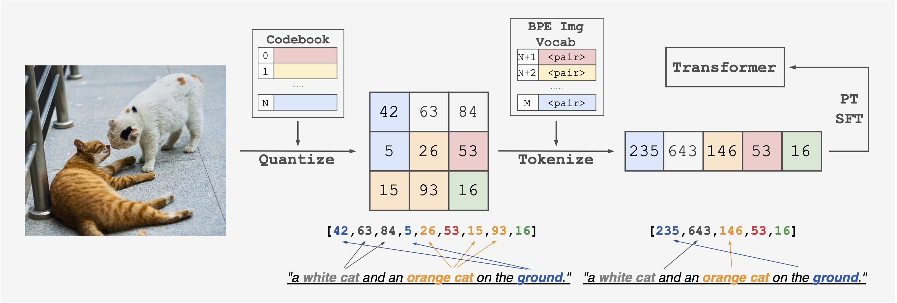

# From Pixels to Tokens: Byte-Pair Encoding on Quantized Visual Modalities

<div align="center">

[[Website]](https://github.com/BeingBeyond/being-vl-0)
[[arXiv]](https://arxiv.org/abs/2410.02155)

[]()
[]()



</div>

We propose a novel training paradigm for multimodal learning through our BPE Image Tokenizer, which applies the principles of text tokenization to visual data. Unlike conventional approaches, our method directly incorporates structural prior information into image tokens, enabling Transformer models to better learn across modalities. Our `Being-VL-0` model demonstrates how this paradigm effectively bridges the gap between visual and textual representation learning.


## Code
We will release our code soon.

## Citation
If you find our work useful, please consider citing us!
```
@inproceedings{zhang2025pixels,
  title={From Pixels to Tokens: Byte-Pair Encoding on Quantized Visual Modalities},
  author={Wanpeng Zhang and Zilong Xie and Yicheng Feng and Yijiang Li and Xingrun Xing and Sipeng Zheng and Zongqing Lu},
  booktitle={The Thirteenth International Conference on Learning Representations},
  year={2025},
  url={https://openreview.net/forum?id=3TnLGGHhNx}
}
```